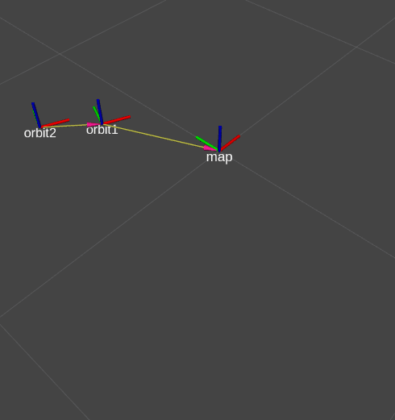

# `arj_packages`
`ROS 2` packages for [sze-info.github.io/arj](http://sze-info.github.io/arj), educational purpose.


## Packages and build

It is assumed that the workspace is `~/ros2_ws/`.

### Clone the packages
``` r
cd ~/ros2_ws/src
git clone https://github.com/sze-info/arj_packages
```

### Build ROS 2 packages
``` r
cd ~/ros2_ws
colcon build --packages-select arj_intro_cpp arj_intro_py arj_transforms_cpp
```

Don't forget to `source` before ROS commands.

``` r
source ~/ros2_ws/install/local_setup.bash
```


